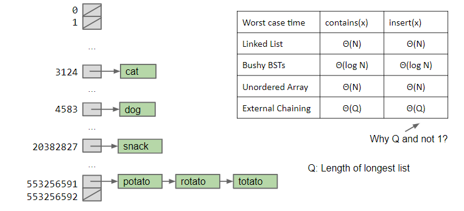

# Lecture 23 Hashing

* [PPT](https://docs.google.com/presentation/d/1hRUkaONWvWP7IZbINLP-G6uOyyulDqury5kop7638co)

***

## 定义

哈希是实现符号表的方法之一，可在 $$\Theta(1)$$（摊销后）的时间复杂度内实现搜索和插入操作。

## 搜索

用哈希实现搜索操作分为两个步骤：

1. 基于哈希函数计算哈希（哈希函数用于将 key 转为数组索引 index，因为 key 的类型可能不是整数，就算是也可能并不会跟数组的索引对应上，所以需要某种方式来将 key 转为数组索引，这就是使用哈希函数的理由。）
2. 将哈希转为数组索引
3. 根据索引直接获取对应的节点。
4. 如果出现了哈希碰撞，则进行相应的处理（一般有两种经典的处理方法）。

如何设计哈希函数？一般来说，希望得到满足以下性质的哈希函数：

1. **一致性**：相同的 key 总产生相同的哈希值
2. 高效性：能够高效地计算哈希
3. 均匀性：能够均匀地将 key 散布到索引区间

一般来说，不同类型的 key 需要不同的哈希函数。

对于**正整数（positive integer）类型的 key，常用的哈希函数是 modular hashing，也就是令哈希为 key 除以哈希表大小 M** 的余数。此处 M 最好是一个素数，这样才能够均匀地将 key 映射到 索引区间 \[0, M-1]。

对于浮点类型（(0, 1) 之间的实数）的 key，常用的哈希函数是将 key 乘以 M 后向下舍入到最近的整数。不过这个方法的缺点是为最高位赋予了更多的权重，这可能会使得最低位在哈希的计算中不起作用，所以更好的做法可能是对 key 的二进制表示（binary representation）利用 modular hashing 计算哈希，这也是 Java 的做法。

对于字符串 string 类型的key，仍然可以用 modular hashing 的方法计算哈希。抽象地说，我们是将字符串视为一个很大的正整数，然后对该整数运用 modular hashing。

```java
int hash = 0;
for (int i = 0; i < s.length(); i++) // N 是字符串的长度
   hash = (R * hash + s.charAt(i)) % M;
```

以上代码相当于将字符串视为一个 N 位的 R（注意 R 最好是素数，这样才能让字符的所有比特都起作用）进制数。Java 在计算 string key 的哈希时也使用了类似的方法。

对于复合类型的key，计算哈希时就需要将各个部分都囊括进来。

> 在开发性能很重要的应用时，需要注意是否使用了糟糕的哈希函数。糟糕的哈希函数可能会在计算哈希时花费过长的时间，从而导致性能受到影响。如果计算哈希的代价比较高昂的话，也可以考虑缓存哈希，Java 在 String key 的哈希求解中就是这么做的。

在 Java 中所有的对象类型都有 **hashCode** 和 **equals** 方法，前者返回一个 32 比特的正整数，后者用于比较两个对象是否相同。如果两个对象相同，那么它们的 **hashCode** 方法一定返回相同的值。但如果两个对象的 **hashCode** 方法返回相同的值，这两个对象也不一定相等。

当我们在 Java 中自定义类型并自定义 hashCode 方法时，如果该自定义类型拥有一些对象类型（比如 string），那么在自定义 hashCode 方法时可以借助这些对象类型的 hashCode 方法辅助计算：

```java
public class Transaction
{
 ...
 private final String who;
 private final Date when;
 private final double amount;
 public int hashCode()
 {
    int hash = 17;
    hash = 31 * hash + who.hashCode();
    hash = 31 * hash + when.hashCode();
    hash = 31 * hash
    + ((Double) amount).hashCode();
    return hash;
 }
 ...
}
```

***

## 冲突处理

解决哈希冲突的办法一般有两种：

1. **Seperate Chaining** 或者叫 **External Chaining**
2. linear probing

### External Chaining

External Chaining 的思想就是将哈希相同的所有 items 存储在一个**链表**（linked list）中。

<figure><figcaption><p>External Chaining 示例</p></figcaption></figure>

#### External Chaining 性能分析

External Chaining 的查找和插入操作的时间复杂度取决于 bucket 中所含的元素个数。如果 N 个元素均匀地分布到 M 个 bucket 中，那么上述两个操作的**平均时间复杂度**为 $$\Theta(L)$$，其中 L = N/ M，也被称为 load factor。

<figure><figcaption></figcaption></figure>

可以看出，当 L 很小时，查找和插入操作的速度是非常快的，所以为了保持性能，我们应该通过某种办法让 L 保持较小的值。

具体的办法是在 L 超出某个阈值时增加 bucket 的数量：

<figure><figcaption><p>load factor 大于等于 1，扩容</p></figcaption></figure>

上述所讲的数据结构称为哈希表：

* 通过一个哈希函数将每个 item 映射到某个索引处的 bucket 中


> 注意哈希并不适用于有顺序要求的符号表 symbol table，因为寻找最值的操作是线性的。
